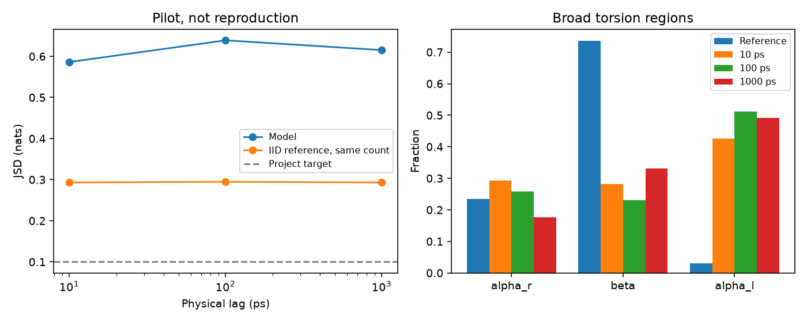

# Local CPU implicit transfer operators

This project reimplements learned molecular transition operators and checks whether their samples reproduce molecular thermodynamics and kinetics. Its planned extension tests reference-free detectors for unphysical generated configurations.

**Everything runs locally on CPU, including training and OpenMM. No GPU, MPS, cloud service, or remote job is needed. Phase 1 is implemented as a working pilot; scientific acceptance has not passed.**

The initial 2,000-update alanine run took 44.1 seconds on this Mac and produced phi/psi JSDs of **0.586, 0.639, 0.615 nats** at 10, 100, 1,000 ps. Estimated model/reference timescale ratios were **0.088, 0.836, 6.518**, versus the requested factor-of-two range; CK JSD was **0.682 nats**. These are failed/undersampled pilot results, not reproduction. The predecessor does not report a directly comparable scalar alanine JSD; our proposed target is ≤0.10 nats, not a paper result. See [local results](docs/local_phase1_status.md), [paper notes](docs/paper_notes.md), [CPU scaling plan](docs/scaling_plan.md), [data audit](docs/data_availability.md), [deviations](docs/deviations.md), and [units](units.md).

The corrected-readout model also failed its 2,000-update pilot: JSD **0.624, 0.622, 0.617**, timescale ratios **0.049, 0.552, 4.373**, CK **0.693 nats**. A 20,000-update legacy-model follow-up took 479.4 seconds and remained poor (JSD **0.612–0.633**). All three outcomes are preserved; the readout fix alone does not solve the reproduction.

The diffusion interface was then corrected so the denoiser returns epsilon directly. A fresh 500-update sanity run still failed (JSD **0.631–0.648 nats**, CK **0.693 nats**), so this consistency fix is necessary but insufficient. Its short run is recorded in the status report; no longer fit has been claimed.

The extension has not started: Phase 1 gates block transferable training and hallucination detection. No detector AUROC or TITO reproduction result is claimed. For context, TITO reports peptide TICA JSD mean/median 0.042/0.036 and top-ten timescale discrepancy mean/median 1.204/0.434; these concern a different dataset, projection and model and cannot be compared directly to the alanine numbers above.



This figure shows a failed pilot, not a successful reproduction. Its model omitted a conditioning readout that is now restored in the default configuration; legacy experiment configs explicitly preserve the earlier variant.

## Run locally

Run commands from `tito-repro/`. The local `.venv` is already installed. For a fresh installation with Python 3.11:

```sh
python3.11 -m venv .venv
.venv/bin/python -m pip install -r requirements-local-lock.txt
.venv/bin/python -m pip install --no-deps -e .
```

The lock records the tested macOS arm64 environment and allowed libraries' transitive dependencies. Editable installation uses the repository configs. Installation and the initial public data download require internet; subsequent experiments work offline.

```sh
# Numerical contracts and tiny CPU train/sample/resume test
.venv/bin/python -m pytest -q

# Synthetic training and distribution figures
.venv/bin/python -m tito_repro.cli experiment=smoke

# Fetch all original alanine trajectories once; subsequent calls verify cached hashes
.venv/bin/python -m tito_repro.cli experiment=alanine_download

# Separate ff14SB/OBC2 implicit-solvent control and energy figure (100 ps pilot)
.venv/bin/python -m tito_repro.cli experiment=alanine_reference

# 2,000-update molecular training, free-energy figures, MSM and CK diagnostics
.venv/bin/python -m tito_repro.cli experiment=alanine_pilot

# Bounded 20,000-update follow-up and the same evaluation
.venv/bin/python -m tito_repro.cli experiment=alanine_cpu_fit

# Corrected conditioning readout: separate 2,000-update local pilot
.venv/bin/python -m tito_repro.cli experiment=alanine_source_pilot
```

Each invocation writes resolved config, environment, seed, log, metrics JSON and figures under `runs/<action>/<timestamp>/`. Molecular pipelines put evaluation artifacts under `evaluation/`; the parent log includes both stages. Checkpoints contain EMA, optimizer, scheduler and RNG states. Raw samples use nm and physical lags use ps. Default training stops after 600 seconds and checkpoints; it never requests an accelerator.

To reproduce only the sampling figures from an existing checkpoint, substitute its local path:

```sh
.venv/bin/python -m tito_repro.cli experiment=alanine_evaluate evaluation.checkpoint=runs/train/20260910_203110_183370/checkpoint.pt
```

Standalone evaluation defaults to `evaluation.rng_mode=seed`. The named molecular pipeline configs use `checkpoint`; specify `evaluation.rng_mode=checkpoint` when resampling one of their checkpoints to reproduce its pipeline figure. This makes sampling independent of unrelated prior random draws.

To produce the finite-sample-control/basin-occupancy figure from saved evaluation arrays (no new model sampling):

```sh
.venv/bin/python -m tito_repro.cli experiment=alanine_audit audit.evaluation_run=runs/evaluate/20260910_203226_407589
```

For another run, change only that run path. Resume a time-limited training run with `experiment=alanine_train train.resume=<checkpoint.pt>`, preserving its original model/data/steps/seed/thread settings through matching config overrides. Increasing the total step count changes the cosine schedule and is rejected on resume; launch a new experiment instead.

## Limitations

- Molecular samples from the first pilot do not reproduce the reference basins. Four short chains and 64 CK branches cannot establish kinetic or CK agreement; matched-count reference JSD is already about 0.294 nats on the fine grid.
- The denoiser is much smaller than the paper's model. DDIM replaces DPM-Solver; native torch ChiroPaiNN is adapted under its MIT license in `src/tito_repro/vendor/ito/`. No additional equivariant library was installed.
- Symmetrized-count fixed-grid MSM estimates are diagnostic, not the paper's Bayesian MSM. The broad basin count screen is not evidence of correct free-energy minima. Whole-chain bootstrap holds the reference fixed and does not establish full uncertainty.
- The 100 ps ff14SB/OBC2 reference is far too short for convergence and differs from the original explicit-solvent ff99SB-ILDN ensemble. They are kept separate. OpenMM timing is a local CPU measurement, not a GPU speed comparison.
- TITO uses flow matching; this Phase 1 DDPM does not yet implement transferability. Full Timewarp evaluation is a major local storage/runtime constraint. Phases 2–4 have not started; no DESRES data is used.
- Results/checkpoints and downloaded trajectories are gitignored. Source hashes and configs provide local provenance; rerunning on different library versions/hardware need not be bitwise identical.
