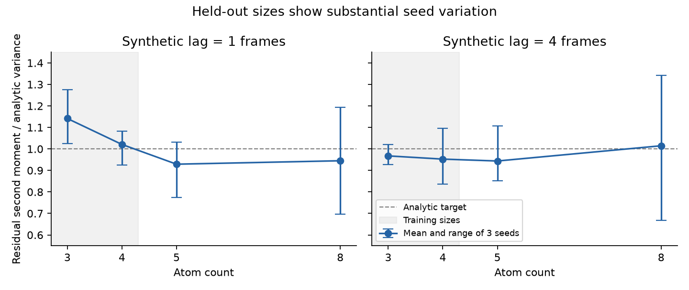

# Exploratory Phase 2 status — 2026-09-18

Phase 2 development has started under the revised [development policy](development_policy.md). Phase 1 scientific acceptance remains failed/incomplete. Everything below ran locally on CPU with existing dependencies and no downloaded data.

The prototype learns a velocity field along `x(t) = (1-t) z + t y`, where `z` is a centered Gaussian and `y` is the target. The supervised velocity is `y-z`; sampling integrates from 0 to 1 using Heun's method. This is a basic conditional flow construction in the [flow matching framework](https://arxiv.org/abs/2210.02747), with independent endpoint pairing. It does not implement TITO's optimal-transport alignment, chemical bond features, or full architecture. Flow time is dimensionless and is separate from the lag between synthetic frames.

One set of model parameters handles different atom counts. Element-number embeddings replace fixed atom-index identities for this model only. Each batch has a single size/topology; batches alternate sizes and lags without padding. Element labels on Gaussian point clouds are synthetic test inputs, not chemical structures. Phase 1 keeps its original atom-index interface.

The first pilot trained 2,000 updates on 3- and 4-atom centered Gaussian AR(1) pairs, correlation 0.8 per frame, lags 1 and 4, batch 16, seed 20260910. Training took 7.95 seconds with two CPU threads. Evaluation used 128 independent pairs per size/lag, fixed before/after inputs, and 20 Heun steps (40 field evaluations). Five-atom inputs were excluded from training.

| Atoms | Lag (frames) | Velocity MSE before → after | Sample residual second moment | Analytic conditional variance |
|---|---:|---:|---:|---:|
| 3 | 1 | 4.104 → 1.971 | 0.246 | 0.240 |
| 3 | 4 | 4.156 → 2.924 | 0.566 | 0.555 |
| 4 | 1 | 4.555 → 2.323 | 0.250 | 0.270 |
| 4 | 4 | 4.443 → 3.092 | 0.578 | 0.624 |
| 5 (held-out size) | 1 | 4.770 → 2.178 | 0.223 | 0.288 |
| 5 (held-out size) | 4 | 4.663 → 3.278 | 0.567 | 0.666 |

Velocity MSE sums Cartesian error and averages over atoms and examples. Residual second moment averages squared coordinate residuals around the known conditional mean; it includes bias and is not a complete distribution test. The analytic per-coordinate variance includes the centering factor `(1-1/atoms)`. The held-out size underestimates the target second moment by approximately 22% and 15%, respectively. No uncertainty intervals or acceptance threshold were applied. Finite, centered outputs and lower loss show a working prototype, not molecular transferability.

Reproduce from the repository root:

```sh
.venv/bin/python -m tito_repro.cli experiment=phase2_synthetic
```

Training is limited to 2,000 updates or 60 seconds, checked between updates. Setup and bounded evaluation are outside that training timer. Periodic checkpoints and loss arrays are saved, but this prototype has no resume command or EMA yet. Results, config and checkpoint provenance are committed under `docs/results/phase2_synthetic_2000*`; the original artifacts are under `runs/phase2_synthetic/20260918_164507_673450`.

## Three-seed size calibration

Three completed 2,000-update runs used seeds 20260910, 20260911 and 20260912, with training sizes 3/4 and evaluation sizes 3/4/5/8. Other settings match the first pilot. Each seed controls both training and independent evaluation draws, so the spread combines training and finite-evaluation variation. It does not isolate training instability. No additional data was downloaded.

| Atoms | Lag 1: mean ratio (seed range) | Lag 4: mean ratio (seed range) |
|---|---:|---:|
| 3 | 1.141 (1.024–1.276) | 0.968 (0.926–1.021) |
| 4 | 1.021 (0.926–1.082) | 0.953 (0.835–1.096) |
| 5, held-out | 0.929 (0.775–1.031) | 0.944 (0.852–1.107) |
| 8, held-out | 0.945 (0.697–1.194) | 1.015 (0.668–1.342) |

Ratios divide the generated residual second moment by the analytic conditional variance; 1 is the target. All samples were finite. The eight-atom means obscure substantial variation, so this is not evidence of reliable size generalization. Ranges and sample standard deviations across three seeds are descriptive, not confidence intervals.



```sh
.venv/bin/python scripts/calibrate_flow.py
.venv/bin/python scripts/plot_flow_calibration.py
```

The campaign applies the 60-second training cap per seed and a 180-second subprocess timeout per full invocation. The plot reads committed results. Metrics, configs, environment and checkpoint hashes are preserved in `docs/results/flow_calibration_3seeds*`; original checkpoints are under `runs/flow_calibration/20260918_184807_441433`.

## Reuse checkpoints for cheaper diagnostics

Standalone evaluation now loads existing weights and saves raw condition/reference/generated/prior arrays. It permits new sizes, sample counts, solver budgets and evaluation seeds without retraining:

```sh
.venv/bin/python -m tito_repro.cli experiment=phase2_evaluate \
  flow_evaluation.checkpoint=<local-flow-checkpoint.pt> \
  flow_evaluation.solver_steps=40
```

For training seed 20260910, increasing Heun steps from 20 to 40 on identical evaluation inputs changed residual second moments by less than 0.6% relative across every tested size/lag. At eight atoms, lag 1 changed 0.21971→0.22039 and lag 4 changed 0.48629→0.48350. Doubling solver work did not resolve that run's low dispersion. This is a single-model solver sensitivity check, not a convergence proof. Snapshot files are `docs/results/flow_solver40*`; raw samples are in `runs/phase2_evaluate/20260918_185025_129926`.

Next useful work is to separate model-seed variation from evaluation noise with shared evaluation inputs and larger samples, then add validated topology/bond features and a cached-data molecular pilot. Molecular reproduction, optimal-transport matching and peptide transferability remain unestablished.
